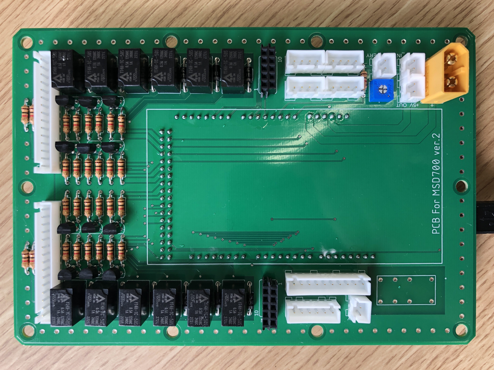
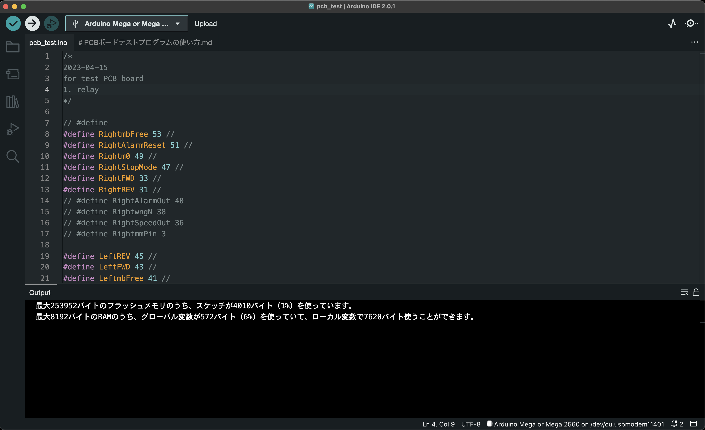
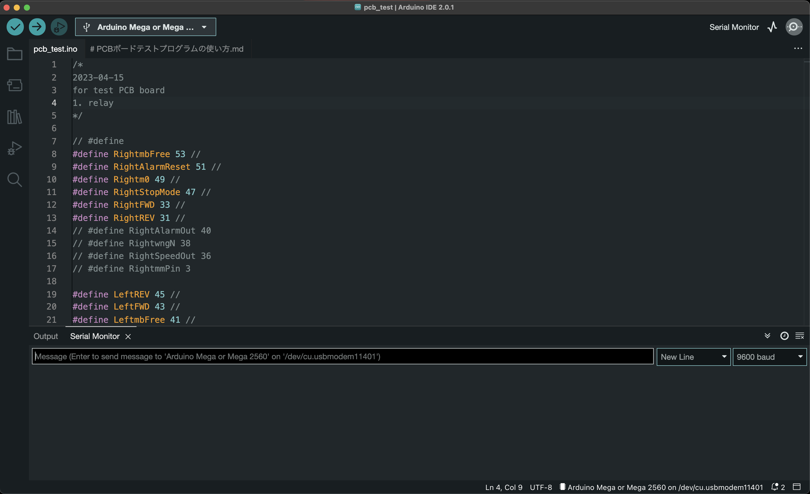
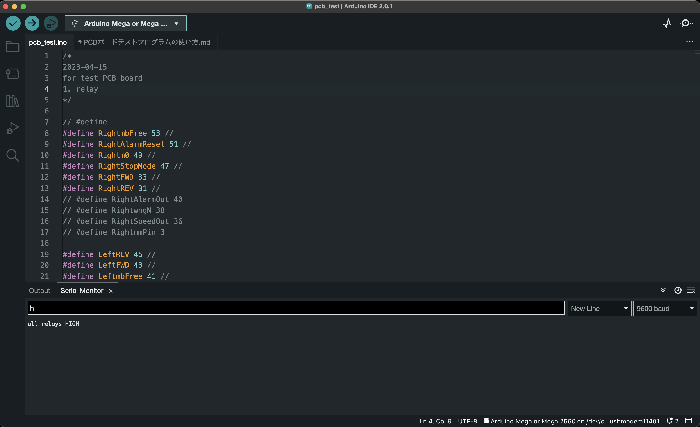

# PCBボードテストプログラムの使い方

## Arduino準備
## 1. プログラムを書き込む
Arduinoを接続して，ボードを選択．

## 2. シリアルモニタ(Serial Monitor)の起動

## 3. コマンドを入力する
シリアルモニタのコマンド窓にコマンドを入力して，`Enter`で送信．

## コマンド

- `o` : 全てのリレーをLOWにする
- `h` : 全てのリレーをHIGHにする
- `l` : 左側のリレー（CR1〜6）をHIGHにする
- `r` : 右側のリレー（CR7〜12）をHIGHにする

以下，各リレーをHIGHにする
- `1` : CR1
- `2` : CR2
- `3` : CR3
- `4` : CR4
- `5` : CR5
- `6` : CR6
- `7` : CR7
- `8` : CR8
- `8` : CR8
- `9` : CR9
- `q` : CR10
- `w` : CR11
- `e` : CR12

## リレー対応表

## 4. テスト方法
1. コマンド`h`ですべてのリレーを動作させる．

    動作のカチッという音が12回聞こえた場合，正常に動作している．-> 検査終了

  12回動作しなかった場合

2. コマンド`r`，`l`を使って右側か左側のどちらに異常があるかを確認する．

3. `1`〜`e`のコマンドで一つずつのリレーを検査していく．

    動作しなかったリレーはハンダの不良か，トランジスタの不良が主な原因と考えられる．

4. ハンダのやり直し．1. に戻って再検査を行う．